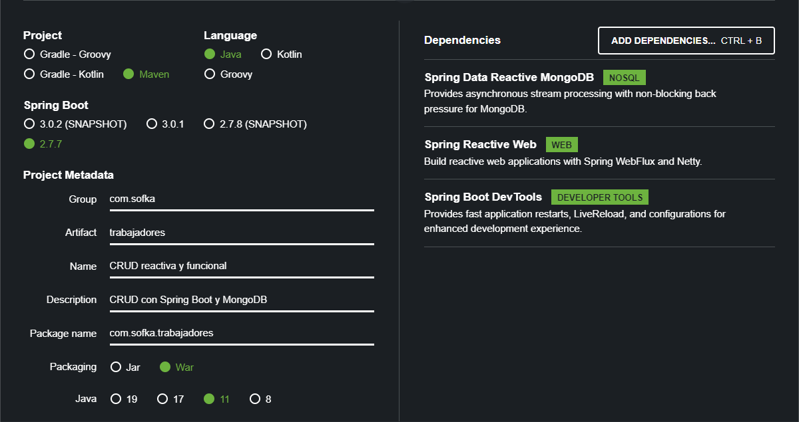

# CRUD usando los principios reactivos y webflux

Proyecto realizado en Spring Boot con las siguientes dependencias:

* Spring Data Reactive MondoDB
* Spring Reactive Web
* Sprig Boot Dev Tools

CRUD con Spring Boot y MongoDB usando los principios reactivos y webflux,
donde usamos el modelo de un trabajador, con los atributos :

* id
* nombre
* edad
* activo

Sobre los cuales podemos trabajar con los metodos de :

* guardar : /trabajador
* borrar  : /borrar/{id}
* borrar Todos : /borrartodos
* actualizar : /actualizar/{id}
* listar Todos : /trabajadores
* listar por Id : /listarid/{id}
* ver trabajadores activos : /activos

